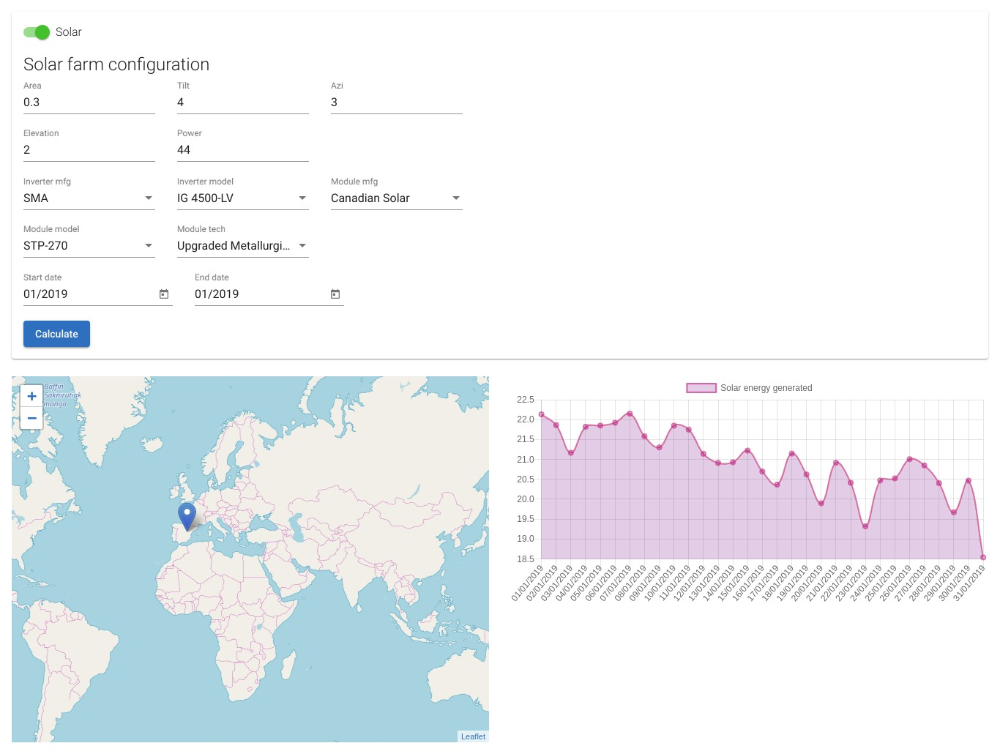
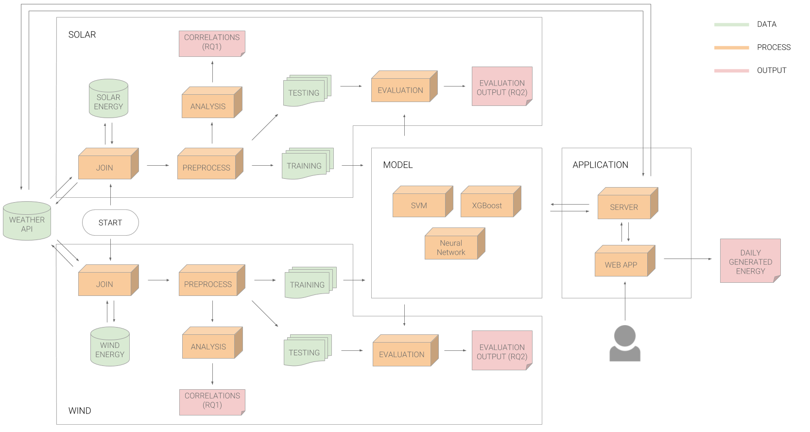

# Energy forecasts driven by big data

A web app allowing users to view historical and future solar energy generation.    
The report can be found [here](https://drive.google.com/open?id=1CQBaUppiORZo2fs5DBOr_yuqdlKYKuuB).

## File structure
|folder name| folder purpose                                                              |
|----------|------------------------------------------------------------------------------|
| analysis | A collection of models used for prediction - SVM, XGBoost and neural network |
| cleaning | A preprocessing pipeline that handles missing values and reformats the data  |
| data     | Solar and wind energy generation data + plant configurations                 |
| images   | Plots of explanatory variable correlation and feature importance             |
| joining  | Scripts for accumulating data into training sample                           |
| weather  | Scripts for scraping weather APIs given plant locations                      |
| web      | Code for the web app. Backend in Flask, frontend in Angular.                 |

## System design

